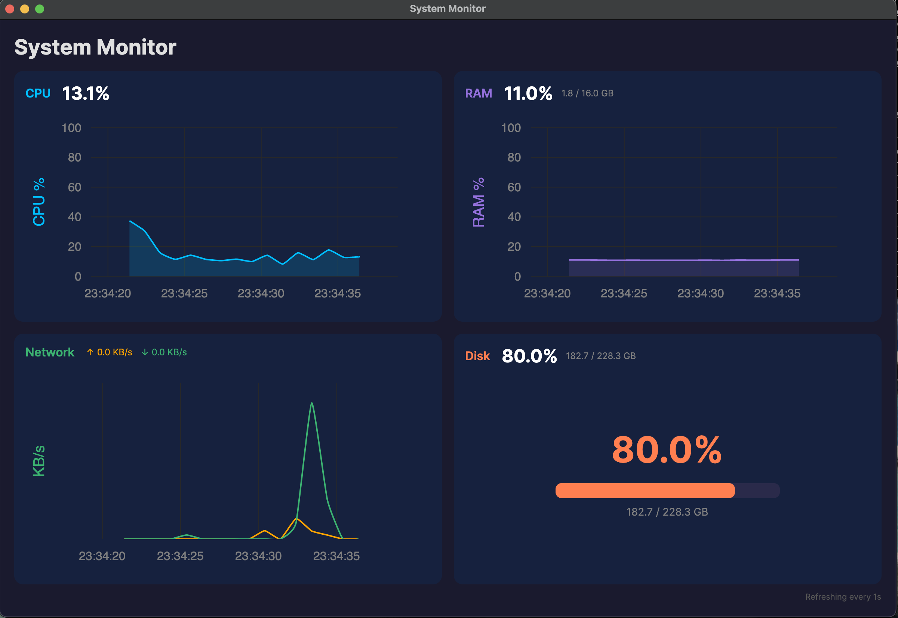

# System Monitor

실시간 시스템 성능 모니터링 데스크톱 앱입니다. Avalonia UI와 .NET으로 만들었으며, macOS/Windows/Linux에서 실행 가능합니다.



## 데모

https://github.com/user-attachments/assets/9bba7711-91fc-4fed-912f-b5a0ed34df78.mov

## 주요 기능

- CPU 사용률 실시간 그래프
- RAM 사용률 실시간 그래프 (사용량/전체 GB 표시)
- 네트워크 송수신 속도 실시간 그래프 (KB/s, MB/s)
- 디스크 사용량 시각화 (프로그레스 바)
- 임계값 초과 시 경고 알림 (CPU 90%, RAM 90%, Disk 95%)
- 1초 간격 자동 갱신
- 다크 테마 UI

## 기술 스택

- **프레임워크**: Avalonia UI 11.2
- **언어**: C# / .NET 9.0
- **차트**: LiveChartsCore (SkiaSharp)
- **아키텍처**: MVVM (CommunityToolkit.Mvvm)

## 실행 방법

### 소스에서 빌드

```bash
cd SystemMonitor
dotnet restore
dotnet run
```

### 빌드된 파일로 실행 (macOS Apple Silicon)

1. `SystemMonitor-macOS-arm64.zip` 다운로드
2. 압축 해제
3. `SystemMonitor` 실행

## 빌드

```bash
cd SystemMonitor
dotnet publish -c Release -r osx-arm64 --self-contained true
```

빌드 결과물: `bin/Release/net9.0/osx-arm64/publish/`

## 프로젝트 구조

```
SystemMonitor/
├── Models/
│   └── SystemMetrics.cs          # 시스템 메트릭 데이터 모델
├── Services/
│   └── MetricsCollector.cs       # CPU, RAM, 디스크, 네트워크 수집
├── ViewModels/
│   └── MainWindowViewModel.cs    # 차트 데이터 바인딩, 알림 로직
└── Views/
    └── MainWindow.axaml          # 대시보드 UI
```

## 라이선스

MIT
